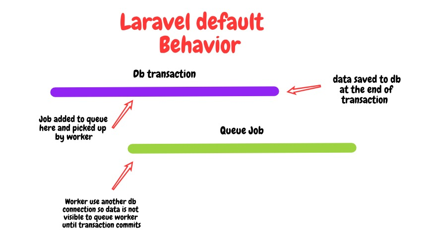
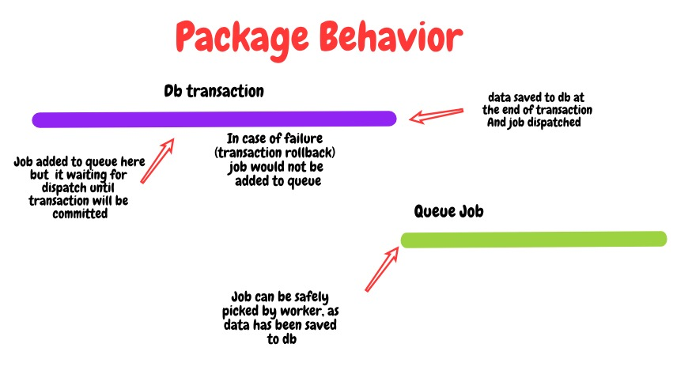

# Laravel transactional jobs
#### Problem:

#### Solution:



By using this package you easily dispatch jobs inside transactions. Cancel job on transaction rollback. Add to queue on transaction committed.

## Installation
_This package requires PHP 7.1 and Laravel 5.8 or higher._
_If you are on a PHP version below 7.1 or a Laravel version below 5.8 just use an older version of this package._

1) Run ```composer require therezor/laravel-transactional-jobs``` in your laravel project root folder

2) Implement `TheRezor\TransactionalJobs\Contracts\TransactionalJob` to jobs that run in the middle of database transactions

```php
<?php

use TheRezor\TransactionalJobs\Contracts\RunAfterTransaction;

class MySuperJob implements ShouldQueue, RunAfterTransaction
{
    use Dispatchable, InteractsWithQueue, Queueable, SerializesModels;
    
    ...
}
```
